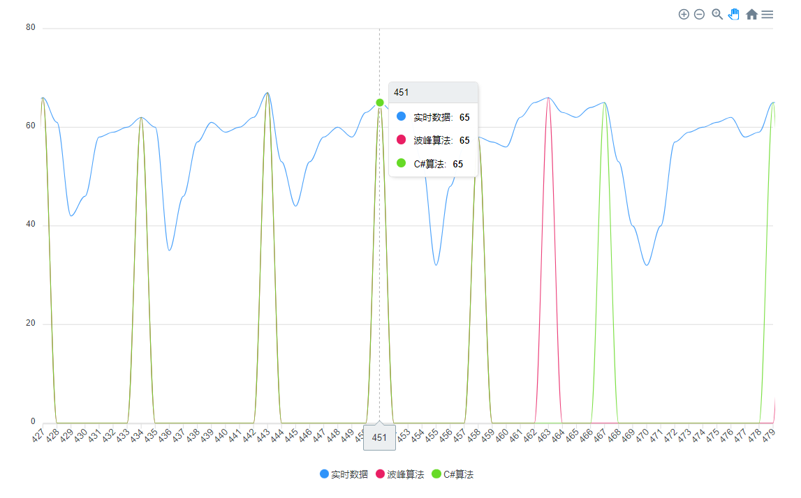

# C# algorithm for crest recognition
https://www.cnblogs.com/bethansy/p/10560341.html



```
var arr = new List<double> { 36, 39, 38, 31, 32, 50, 57, 61, 63, 63, 62, 64, 64, 66, 64, 65, 63, 49, 45, 30, 51, 56, 49, 37, 30, 54, 63, 71, 69, 70, 63, 54, 41, 40, 37, 45, 54, 56, 62, 63, 69, 70, 65, 39, 35, 30, 32, 40, 41, 37, 56, 65, 67, 67, 66, 70, 65, 45, 36, 41, 32, 34, 38, 40, 35, 33, 57, 62, 67, 66, 70, 63, 53, 33, 31, 32, 42, 34, 52, 59, 58, 64, 65, 65, 64, 53, 34, 41, 60, 62, 62, 64, 64, 67, 65, 66, 66, 64, 65, 64, 64, 66, 66, 65, 68, 68, 69, 65, 62, 66, 38, 35, 51, 60, 61, 63, 66, 66, 66, 65, 65, 65, 63, 64, 65, 64, 67, 36, 48, 57, 59, 60, 60, 62, 59, 61, 55, 37, 54, 58, 63, 67, 64, 45, 50, 57, 61, 64, 60, 45, 35, 54, 56, 63, 63, 64, 62, 40, 35, 33, 51, 51, 55, 63, 66, 58, 40, 34, 34, 42, 30, 56, 60, 58, 64, 64, 65, 62, 63, 66, 64, 48, 37, 34, 32, 30, 51, 59, 59, 62, 64, 64, 64, 63, 66, 67, 65, 62, 32, 31, 32, 48, 55, 57, 56, 60, 64, 63, 60, 62, 58, 32, 30, 35, 33, 58, 62, 66, 64, 64, 56, 37, 54, 56, 64, 67, 58, 37, 33, 31, 32, 31, 35, 30, 60, 63, 70, 69, 55, 31, 36, 30, 55, 58, 67, 70, 52, 32, 32, 35, 30, 32, 51, 58, 59, 57, 58, 64, 64, 63, 63, 65, 67, 60, 47, 32, 52, 60, 59, 62, 65, 64, 65, 60, 34, 33, 31, 36, 33, 51, 59, 59, 61, 66, 64, 64, 66, 66, 65, 68, 69, 63, 61, 32, 37, 55, 59, 56, 63, 64, 62, 63, 65, 65, 64, 59, 49, 57, 57, 59, 63, 63, 64, 65, 65, 64, 64, 63, 62, 49, 30, 51, 59, 58, 60, 62, 63, 63, 63, 61, 64, 60, 42, 32, 40, 56, 58, 64, 63, 63, 62, 65, 67, 57, 40, 55, 59, 59, 65, 65, 66, 67, 68, 65, 47, 33, 33, 53, 60, 58, 55, 61, 63, 63, 64, 63, 63, 56, 46, 57, 64, 61, 60, 62, 66, 67, 64, 60, 55, 34, 31, 31, 33, 51, 60, 65, 62, 67, 69, 65, 61, 52, 37, 34, 31, 55, 60, 61, 60, 62, 64, 64, 64, 63, 62, 47, 34, 51, 60, 62, 57, 62, 63, 64, 62, 56, 55, 60, 64, 64, 67, 66, 40, 45, 57, 58, 63, 66, 61, 42, 46, 58, 59, 60, 62, 60, 35, 46, 57, 61, 59, 60, 62, 67, 53, 44, 53, 58, 60, 58, 63, 65, 63, 63, 53, 32, 48, 56, 58, 57, 56, 62, 65, 66, 63, 62, 64, 65, 53, 40, 32, 40, 57, 59, 60, 61, 62, 58, 59, 65, 65, 62, 56, 35, 49, 55, 57, 57, 60, 59, 63, 66, 66, 63, 63, 62, 57, 55, 40, 50, 58, 61, 59, 61, 59, 61, 63, 63, 64, 63, 62, 63, 51, 37, 38, 50, 55, 56, 57, 57, 60, 62, 65, 63, 61, 58, 61, 51, 31, 49, 56, 58, 57, 62, 65, 65, 64, 64, 63, 53, 30, 54, 59, 56, 57, 62, 65, 68, 62, 50, 30, 33, 50, 57, 58, 57, 58, 62, 63, 64, 62, 52, 37, 51, 59, 58, 55, 62, 65, 65, 60, 51, 34, 33, 47, 56, 58, 60, 56, 61, 64, 60, 46, 32, 33, 55, 56, 59, 59, 59, 61, 64, 58, 43, 53, 57, 59, 58, 56, 64, 68, 66, 65, 38, 30, 32, 51, 52, 54, 56, 54, 60, 62, 55, 52, 57, 58, 59, 64, 64, 50, 30, 53, 57, 58, 57, 58, 58, 58, 61, 64, 64, 64, 62, 45, 31, 43, 51, 54, 56, 58, 58, 56, 54, 54, 59, 61, 62, 61, 59, 60, 53, 42, 55, 58, 58, 59, 59, 59, 58, 61, 60, 55, 37 };
find_peak_triangleNum(arr, 5);
```

```
#region //波峰识别算法
/// <summary>
/// 百分位求值
/// </summary>
/// <param name="arr"></param>
/// <param name="percent"></param>
/// <returns></returns>
private double percentTile(List<double> arr, double percent)
{

    arr = arr.OrderBy(k => k).ToList();

    var n = arr.Count();
    var p = percent;//0.95;// p为百分位数0 <= p <= 1，例如p = 0.95 表示95%分位数

    var loc = 1 + (n - 1) * p;

    return arr[(int)loc - 1];
}

/// <summary>
/// 波峰识别算法
/// </summary>
/// <param name="filter_signal"></param>
/// <param name="peak_width"></param>
void find_peak_triangleNum(List<double> filter_signal, int peak_width)
{
    var LIST = filter_signal.Select((k, i) => new kv { i = i, v = k }).ToList();

    var length_data = filter_signal.Count;
    var thre = 0.7 * percentTile(filter_signal, 0.95);
    var l = new List<int>();

    for (int i = 1; i < length_data - 1; i++)
    {
        if (filter_signal[i - 1] < filter_signal[i] && filter_signal[i] > filter_signal[i + 1] && filter_signal[i] > thre)
        {
            l.Add(i);
            //Console.WriteLine($"{i}, 1");
        }
        else if (filter_signal[i] == filter_signal[i - 1] && filter_signal[i] > thre)
        {
            l.Add(i);  //# 最高点前后可能有相等的情况
            //Console.WriteLine($"{i}, 2");
        }
    }

    //Console.WriteLine(string.Join(",", l));

    var CC = l.Count();
    int cou = 0;
    var ll = new List<int>();
    l.ForEach(p => ll.Add(p));   //copy to ll

    for (int j = 1; j < CC; j++)
    {
        if (l[j] - l[j - 1] < peak_width)   //# 此判断用于将位于同一个峰内的极值点去掉
        {
            if (l[j] > l[j - 1])   //# 同一个峰内的数据，将小的值替换成0
                ll[j - 1] = 0;
            else
                ll[j] = 0;
            cou = cou + 1;
        }
    }

    int rcou = CC - cou;
    Console.WriteLine($"波峰：{rcou}个");
    ll = ll.Where(p => p > 0).ToList();  //# 去掉0的值，这个集合不准，还需要做切片分析
    //Console.WriteLine(string.Join(",", ll));

    var peak_index = new List<kv>();
    //# 找到每个区间内波峰最大值
    //# 截断每个区间再求区间最大值的索引
    for (int i = 0; i < ll.Count(); i++)
    {
        var index_range = new List<kv>();
        if (i == 0)
        {
            index_range = LIST.GetRange(0, ll[i]);
            Console.WriteLine($"[0 - { ll[i]} = {ll[i]}], {string.Join(",", index_range.Select(p => p.i))}");
        }
        else
        {
            var start = ll[i - 1] + 1;
            var end = ll[i];
            if (start + peak_width < end)
                index_range = LIST.GetRange(ll[i - 1] + 1 + peak_width, ll[i] - ll[i - 1] - peak_width).Where(p => p.v >= filter_signal[ll[i]]).ToList();
            else
                index_range = LIST.GetRange(ll[i - 1] + 1, ll[i] - ll[i - 1]).Where(p => p.v >= filter_signal[ll[i]]).ToList();
            Console.WriteLine($"[{ll[i - 1] + 1} - { ll[i]} = {ll[i] - ll[i - 1]}], {string.Join(",", index_range.Select(p => p.i))}");
        }
        peak_index.Add(index_range.OrderByDescending(p => p.v).FirstOrDefault());
    }
    peak_index = peak_index.Where(p => p != null).ToList();

    Console.WriteLine($"共：{peak_index.Count}个");
    Console.WriteLine($"索引：{string.Join(",", peak_index.Select(p => p.i))}");
    Console.WriteLine($"数值：{string.Join(",", peak_index.Select(p => p.v))}");

    //Console.WriteLine(string.Join(",", peak_index.Select(p => $"[{p.i}]={p.v}")));
}
#endregion
```
